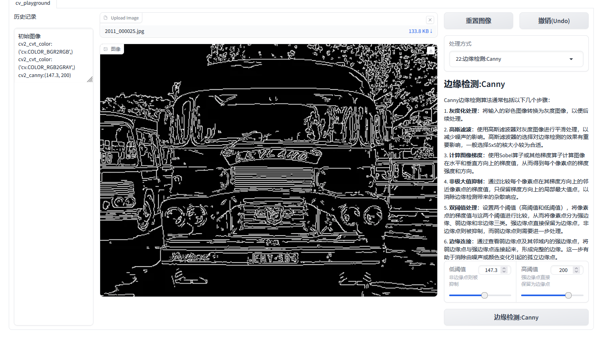

# OpenCV-Playground

## 项目介绍
### 使用 Gradio 构建的,基于opencv的测试项目,用于提供给开发者学习和调试测试参数使用
### 简单易操作的交互方式,支持撤销操作和历史记录查看功能

### 包含常用的20多个openCV操作,涵盖常用的参数调整

### 含有简单易懂的文字描述,以便于理解测试使用


## 直接依赖仅需要3个
```python
import cv2 as cv
import gradio as gr
import numpy as np
```

## 启动/环境
### 直接运行app.py即可
### 基于python3.9开发